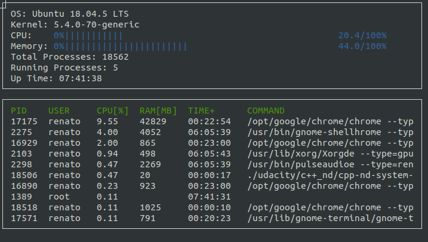

# CppND-System-Monitor

Course project `System Monitor` for the Udacity C++ Nanodegree program.

Starter code for this System Monitor Project is available [here] 
(https://github.com/udacity/CppND-System-Monitor).

## Installation

Clone this repository and install ncurses within your own Linux environment:
```
git clone https://github.com/rodriguesrenato/cpp-nd-system-monitor.git
sudo apt install libncurses5-dev libncursesw5-dev

```

## Usage

This project uses [Make](https://www.gnu.org/software/make/). The Makefile has four targets:
* `build` compiles the source code and generates an executable
* `format` applies [ClangFormat](https://clang.llvm.org/docs/ClangFormat.html) to style the source code
* `debug` compiles the source code and generates an executable, including debugging symbols
* `clean` deletes the `build/` directory, including all of the build artifacts

First go to the project directory and run `make build`. This will create an executable `monitor` at `build` directory.

Then `./build/monitor` to run the system monitor.
